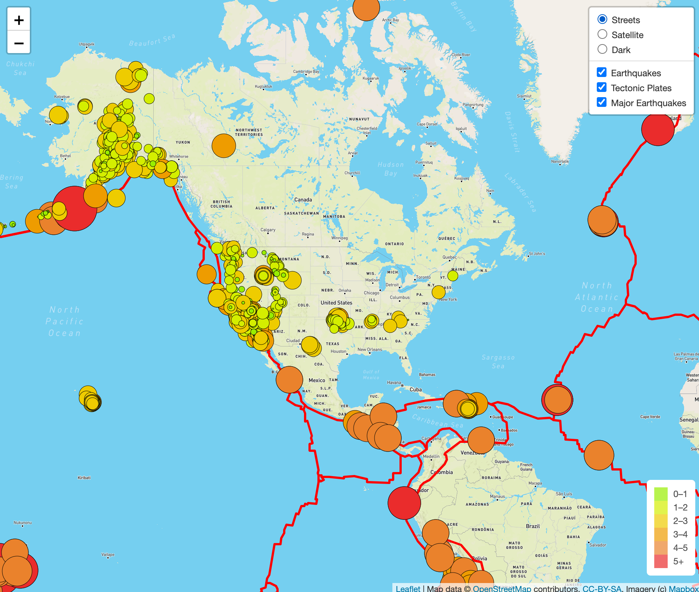
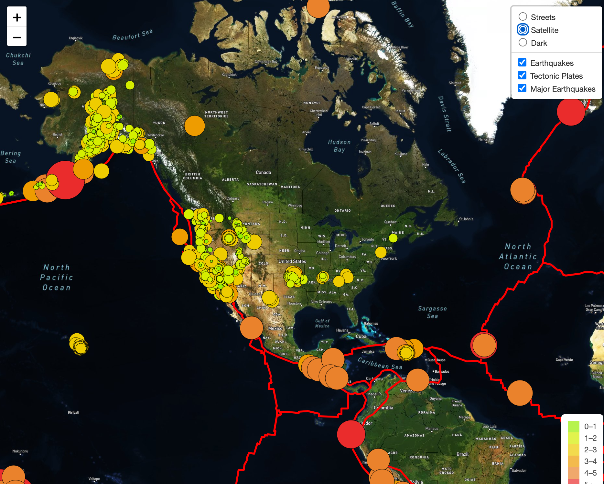

# Mapping_Earthquakes

## Overview
Earthquake Mapping project using Leaflet, Mapbox, JavaScript and HTML to build a dunamic website that pulls data on earthquakes, tectonic plates and major earthquakes (defined at earthquakes with magnitudes of 4.5 or greater) and plots this data on a map. We use MapBox API to pull the map layers which allow users to scroll and zoom around the map. We use the Leafletjs JavaScript library to add interactive layers and controls, which allow users to turn on some or all of the layers visually showing the different data relating to earthquakes and tectonic plates. We use 

## Resources
* Visual Studio Code Version: 1.47.3
* JavaScript v. ???
* Leafletjs (open-source JavaScript library)
* MapBox
* Choropleth

## Results

Screen shot of Earthquake Map showing 'Streets' style and all 3 layers: Earthquakes, Tectonic Plates & Major Earthquakes

Our map showing the Satellite Style and all 3 data layers:

Our map showing the Dark Style:

In this screenshot we see the interactive control features showing only the tectonic plates and major earthquakes:

